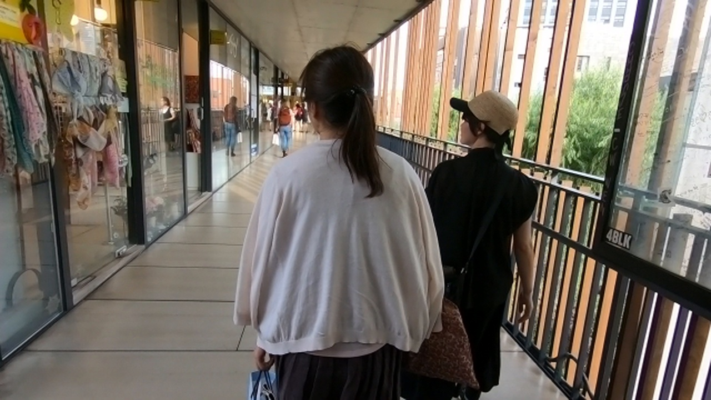

# keras_vsrnet

### Overview
I created Video Super Resolution with Convolutional Neural Networks using Python and Keras.

### Experiment environment
- OS : Windows 10
- CPU : AMD Ryzen 5 3500 6-Core Processor 8GB
- GPU : NVIDIA GeForce RTX 2060 SUPER

### How to use
1.Downloads REDS datasets.
https://seungjunnah.github.io/Datasets/reds.html

2Learning
```
main.py --mode srcnn
```
3.Evaluate
```
main.py --mode evaluate
```
### Result example
#### High Image


#### Low Image PSNR:32.34dB

#### Pred Image PSNR:34.56dB

